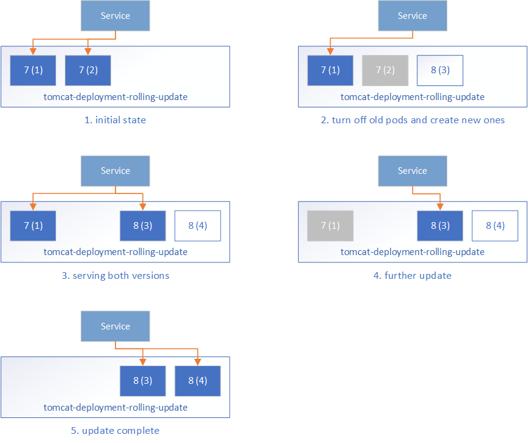
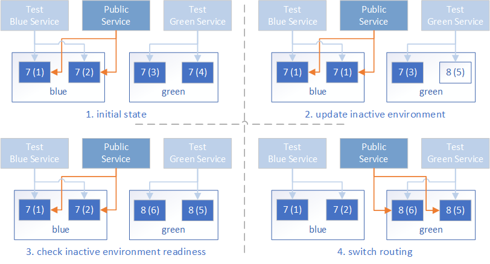

# Zero-downtime Deployment in Kubernetes with Jenkins

"How do I do zero-downtime deployment" is a frequently asked question ever since we added
the [Kubernetes Continuous Deploy](https://plugins.jenkins.io/kubernetes-cd) and
the [Azure Container Service](https://plugins.jenkins.io/azure-acs) plugins in the Jenkins update center.
To get the PM off my back, we created a quickstart template on Azure to demonstration how we can do that. 
Although it's based on Azure, the concept could be applied to general Kubernetes cluster.

## Rolling Update

Kubernetes supports `RollingUpdate` strategy which replace the old pods with new ones gradually while
serving the clients without downtime. To perform RollingUpdate deployment,
1. set `.spec.strategy.type` to `RollingUpdate`, which is the default value.
1. set `.spec.strategy.rollingUpdate.maxUnavailable` and `.spec.strategy.rollingUpdate.maxSurge` to some reasonable value.
   * `maxUnavailable`: the maximum number of Pods that can be unavailable during the update process. Can be absolute
      number or percentage of the `replicas` count, default to 25%.
   * `maxSurge`: the maximum number of Pods that can be created over the desired number of Pods. Can be absolute number
      or percentage of the `replicas` count, default to 25%.
1. configure the `readinessProbe` for your service container, to help Kubernetes determine the state of the Pods.
   Kubernetes will only route the client traffic to the Pods whose liveness probe is successful.

We use deployment of the official Tomcat image to demonstrate this:

```yaml
apiVersion: extensions/v1beta1
kind: Deployment
metadata:
  name: tomcat-deployment-rolling-update
spec:
  replicas: 2
  template:
    metadata:
      labels:
        app: tomcat
        role: rolling-update
    spec:
      containers:
      - name: tomcat-container
        image: tomcat:${TOMCAT_VERSION}
        ports:
        - containerPort: 8080
        readinessProbe:
          httpGet:
            path: /
            port: 8080
  strategy:
    type: RollingUpdate
    rollingUpdate:
      maxUnavailable: 1
      maxSurge: 50%
```

If the Tomcat running in the current deployments are version 7, and we can replace `${TOMCAT_VERSION}` with 8 and apply
this to the Kubernetes cluster. With [Kubernetes Continuous Deploy](https://plugins.jenkins.io/kubernetes-cd) or
the [Azure Container Service](https://plugins.jenkins.io/azure-acs) plugin, the value can be fetched from environment
variable which eases the deployment process.

Under the scene, Kubernetes manages the update like the following:



1. Initially, all pods are running Tomcat 7 and the frontend Service routes the traffic to these pods.
1. During the rolling update, Kubernetes takes down some Tomcat 7 pods and create some new Tomcat 8 pods. It ensures:

   * at most `maxUnavailable` pods in the desired Pods can be unavailable, that is, at least 
      (`replicas` - `maxUnavailable`) pods should be serving the client traffic, which is `2-1=1` in our case.
   * at most `maxSurge` more pods can be created during the update process, that is `2*50%=1` in our case.

   One Tomcat 7 Pod is taken down, and one Tomcat 8 Pod is created. Kubernetes will not route the traffic to any of them
   because their readiness probe is not successful.
1. When the new Tomcat 8 Pod is ready as determined by the readiness probe, Kubernetes will start routing the traffic to it.
   This means during the update process, user may see both the old service and the new service.
1. The rolling updates continues by taking down Tomcat 7 Pods and create Tomcat 8 pods, and route the traffic to the ready
   Pods.
1. Finally, all Pods are on Tomcat 8.

Rolling Update ensures we always have some **Ready** backend Pods serving the client requests, so there's no service
downtime. However, there's also some issues that needs extra care:

1. During the update, both the old Pods and new Pods may serve the requests. Without well defined session affinity in the
   Service layer, a user may be routed to the new Pods and later back to the old Pods.

   This also requires us to maintain well defined forward & backward compatibility on both data and API, which is difficult
   generally.
1. It may take a long time before a Pod is ready for traffic after it is started. There may be a long time window where the
   traffic is served with less backend Pods than usual. Generally, this should not be a problem as we tend to do the production
   upgrade when the service is not busy. But this will also extend the time window for issue 1.
1. We cannot do comprehensive tests for the new Pods being created. Moving the products from dev / QA environment to production
   environment is always a big risk of breaking the current production functionality. The readiness probe can do some work to
   check the readiness, however, it should be a light loaded task that can be run periodically and not suitable to be used 
   as an entrance to start the complete tests.

## Blue/green Deployment

*Blue/green deployment quoted from [TechTarget](http://searchitoperations.techtarget.com/definition/blue-green-deployment)*
> A blue/green deployment is a change management strategy for releasing software code. Blue/green deployments,
> which may also be referred to as A/B deployments require two identical hardware environments that are 
> configured exactly the same way. While one environment is active and serving end users, the other environment remains idle.

Container technology offers stand-alone environment to run the desired service, which makes it super easy to create identical
environments as required in the blue/green deployment. The loosely coupled Services - ReplicaSets, and the label/selector based
service routing in Kubernetes makes it easy to switch between different backend environments. With these techniques, the blue/green
deployment in Kubernetes can be done as followed:

1. Before the deployment, the infrastructure is prepared as followed:
   1. Prepare the blue deployment and green deployment with `TOMCAT_VERSION=7` and `TARGET_ROLE` set to `blue` or
      `green` respectively.

      ```yaml
      apiVersion: extensions/v1beta1
      kind: Deployment
      metadata:
        name: tomcat-deployment-${TARGET_ROLE}
      spec:
        replicas: 2
        template:
          metadata:
            labels:
              app: tomcat
              role: ${TARGET_ROLE}
          spec:
            containers:
            - name: tomcat-container
              image: tomcat:${TOMCAT_VERSION}
              ports:
              - containerPort: 8080
              readinessProbe:
                httpGet:
                  path: /
                  port: 8080
      ```
   1. Prepare the public service endpoint, which initially routes to one of the backend environment, say `TARGET_ROLE=blue`.

      ```yaml
      kind: Service
      apiVersion: v1
      metadata:
        name: tomcat-service
        labels:
          app: tomcat
          role: ${TARGET_ROLE}
          env: prod
      spec:
        type: LoadBalancer
        selector:
          app: tomcat
          role: ${TARGET_ROLE}
        ports:
          - port: 80
            targetPort: 8080
      ```
   1. Optionally, prepare some test endpoint so that we can visit the backend environments for testing. They are
      similar to the public service endpoint, but they are intended to be accessed internally by the dev/ops team
      only.

      ```yaml
      kind: Service
      apiVersion: v1
      metadata:
        name: tomcat-test-${TARGET_ROLE}
        labels:
          app: tomcat
          role: test-${TARGET_ROLE}
      spec:
        type: LoadBalancer
        selector:
          app: tomcat
          role: ${TARGET_ROLE}
        ports:
          - port: 80
            targetPort: 8080
      ```
1. Update the application in the inactive environment, say `green` environment. Set `TARGET_ROLE=green` and 
   `TOMCAT_VERSION=8` in the deployment config to update the `green` environment.
1. Test the deployment via the `tomcat-test-green` test endpoint to ensure the `green` environment is ready to serve client
   traffic.
1. Switch the frontend Service routing to the `green` environment by updating the Service config with `TARGET_ROLE=green`.
1. Do some more test on the public endpoint to ensure it is working properly.
1. Now the `blue` environment is idle and we can:
   * leave it with the old application so that we can roll back if there's issue with the new application
   * update it to make it a hot backup of the active environment
   * reduce its replication count to save the occupied resources



As compared to Rolling Update, the blue/green update

* Does not rely on the update strategy of a specific backend environment, either `RollingUpdate` or `Recreate` will do.
* The public service is either routed to the old applications, or new applications, but never both.
* The time it takes for the new Pods to be ready does not affect the public service quality, as the traffic will only be
   routed to the new Pods when all of them are tested to be ready.
* We can do comprehensive tests on the new environment before it serves the public traffic. Just keep in mind this is in
   production and the tests should not polute the applicaiton data.

## Jenkins Automation

Use of plugins
Deployment steps mapped to Pipeline stages

## Put It All Together

Quickstart template

